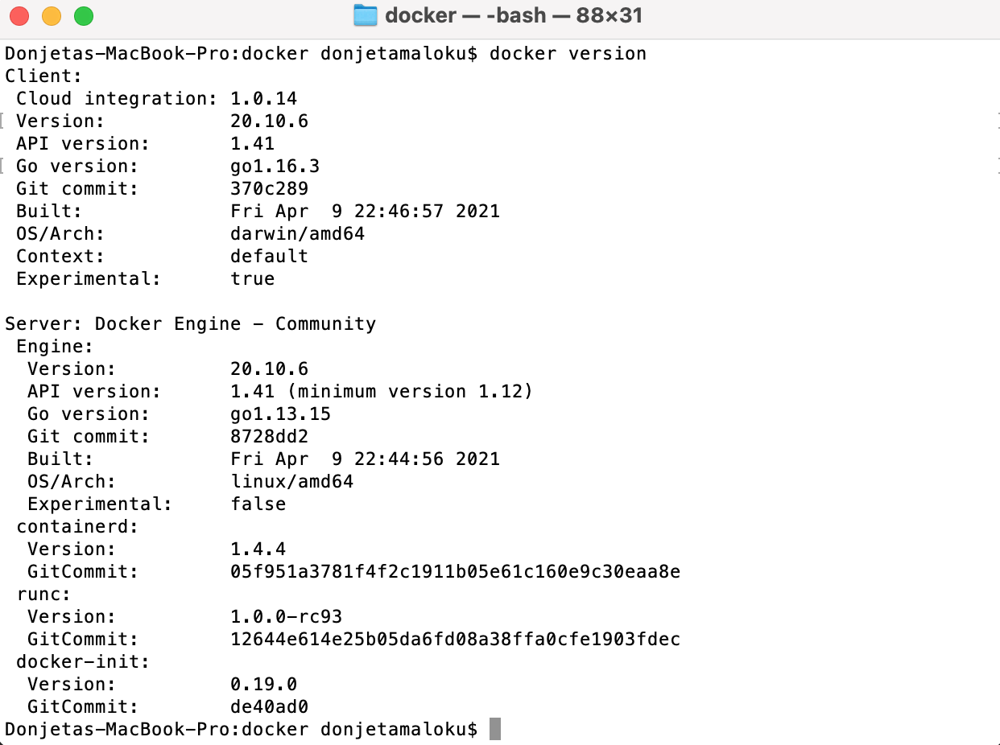
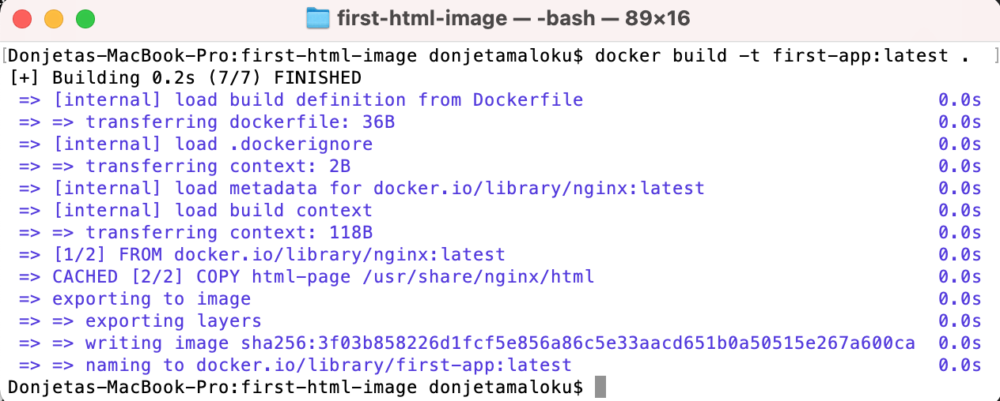
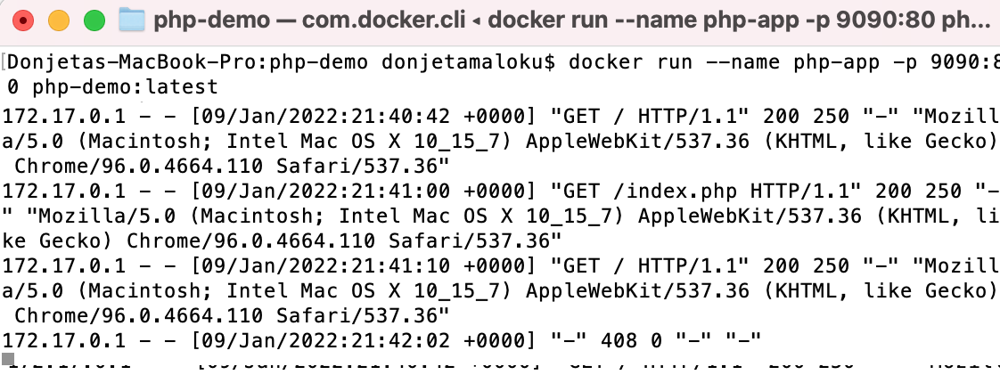

Së pari do të bëjm një prezantim të shkurtër se çfarë është Docker dhe pse ta përdorni, më pastaj do të marr një shembull si të krijoni aplikacionin tuaj të parë me Docker.

### Çfarë është Docker?

Docker është një platformë e hapur për zhvillimin,laciminin dhe ekzekutimin e aplikacioneve dhe nuk është e obligushme të instaloni server në makinën tuaj lokale si XAMPP ose Apache Tomcat. Po ashtu me Docker, ju mund të menaxhoni infrastrukturën tuaj në të njëjten mënyre siç e menaxhoni aplikacionin tuaj. 


Pra Docker i ofron mundësinë përdoruesit për të paketuar dhe ekzekutuar një aplikacion në një mjedis të pavarur dhe ky mjedis i izoluar quhet kontejner(eng. Containers).

Kontejneret janë të lehtë për tu konfiguruar dhe përmbanjnë gjithçka që nevojitet për të ekzekutuar aplikacionin tuaj. 
Pra në një kontejnerë mund të vendosni aplikacionin e juaj, një databazë ose një sistem operative etj. Po ashtu ju mund të ekzekutoni një apo më shumë kontejnerë në çfardo makine, server apo cloud.

### Imazhet

Një imazh Docker përmban gjithçka që nevojitet për të ekzekutuar një aplikacion si një kontejner. Kjo përfshin:
- kodin
- kohën e ekzekutimit (eng. runtime)
- librarit
- variablat e mjedisit(eng. enviroment variables)
- skedarët e konfigurimit(eng. configuration files)

Imazhi më pas mund të vendoset në çdo mjedis Docker dhe të ekzekutohet si një kontejner.

### Kontejner
Një kontejner është një shembull i ekzekutushëm i një imazhi . Nga një imazh mund të krijoni kontejnerë të shumtë, po ashtu mund të lidhni një kontejner me një ose më shumë rrjete(eng. networks), të bashkangjitni një ruatje (eng. stroage) në të ose të krijoni një imazh bazuar në fazën aktuale.

### Pse duhet me përdor Docker një zhvillues?

Për t'iu përgjigje më së miri kësaj pyetje, shih listën më poshtë për përfitimet që mund të gjeni:

1. Docker është i shpejtë. Ndryshe nga një makinë virtuale, aplikacioni juaj mund të fillojë në pak sekonda dhe të ndalojë po aq shpejt.
2. Docker është multi-platformë. Ju mund të ekzekutoni kontejnerin tuaj në çdo sistem.
3. Kontejnerët mund të ndërtohen dhe shkatërrohen më shpejt se një makinë virtuale.
4. Nuk ka më vështirësi në konfigurimin e mjedisit tuaj të punës. Pasi të konfigurohet Docker juaj, nuk do t'ju duhet të riinstaloni më manualisht varësitë tuaja. Nëse ndryshoni kompjuterë ose nëse një punonjës i bashkohet kompanisë suaj, ju duhet t'i jepni atyre vetëm konfigurimin tuaj.
5. Ju e mbani të pastër hapësirën tuaj të punës, pasi secili prej mjediseve tuaja do të jetë i izoluar dhe ju mund t'i fshini ato në çdo kohë pa ndikuar në pjesën tjetër.
6. Do të jetë më e lehtë të lanconi projektin tuaj në serverin tuaj në mënyrë që ta vendosni atë në internet.

### Si te instalojm Docker?

Docker është në dispozicionë për të gjitha sistemet operative, MacOS, Windows dhe Linux.

Për detaje se si te instaloni Docker në sistemin operative mund te gjeni në këtë link [https://docs.docker.com/get-docker/](https://docs.docker.com/get-docker/)

Pasi të instalohet Docker me sukses dhe startoni në kompjuterin e juaj hapeni një terminal dhe shkruani këtë komandë për të shikuar se cili version i Docker është instaluar:

```bash
docker version
```


### Shembull si të paketojmë aplikacionin tuaj në Docker

Tani keni njohuri se çfarë është Docker, është koha për të krijuar aplikacionin tuaj të parë!

Qëllimi i ketij tutoriali të shkurtër është të paketojm një Aplikacion bazë PHP.

#### Krijo projektin e tuaj

Për të krijuar aplikacionin tuaj të parë Docker, ju rekomandoj të krijoni një folder të strukturuar si më posht:

```
.
├── demo-php
    ── index.php
└── Dockerfile
```

`demo-php/index.php` (Ky është një skedar(eng. file) PHP i cili printon vetëm një tekst në ekran).
`Dockerfile` (Ky skedar do të përmbajë udhëzimet e nevojshme se si të shpërndajmë një aplikacion të thjesht në PHP).

> Dockerfile është një tekst që përmbanë të gjitha komandat për te ndërtuar një imazh.

#### Edito index.php skedar dhe shto një tekst

```php
<?php 
        echo "Docker është magjik!"
?>
```

#### Edito Dockerfile
Gjëja e parë që duhet të bëni kur dëshironi të krijoni skedarin tuaj Dockerfile është të pyesni veten se çfarë doni të bëni. Qëllimi ynë këtu është të shpërndjmë(eng. deploy) një aplikacion në PHP.

Hapi i parë që duhet të bëni kur krijoni një skedar Dockerfile është të hyni në faqen [DockerHub](https://hub.docker.com/). Kjo faqe përmban shumë imazhe të para-projektuara për të kursyer kohën tuaj (për shembull: të gjitha imazhet për php apache).

Në rastin tonë, ne do të shkruajmë "PHP Apache" në shiritin e kërkimit, dhe do përzgjedhim imazhin me tag `7.2-apache`. 

```yaml
FROM php:7.2-apache ## Ky imazh është marr nga dockerhub.
COPY index.php /var/www/html/index.php ## Skedari index.php është kopjuar në direktorinë /var/www/html në imazh.
EXPOSE 80 ## Porti 80 është ekspozuar për apache.
CMD ["usr/sbin/apache2ctl", "-D", "FOREGROUND"] ## Apache ka filluar në kontenjer.
```

#### Krijo imazhin Docker
Pasi kodi juaj është i shkruar në Dockerfile, gjithçka që duhet të bëni është të krijoni imazhin tuaj që të përmbajë aplikacionin tuaj.

Hapeni një terminal dhe shkruani komadën më poshtë:

`docker build -t php-demo:latest . `

Opsioni '-t' ju mundëson të përcaktoni emrin e imazhit tuaj. Në rastin tonë ne kemi zgjedhur 'php-demo' por ju mund të vendosni çfarë do emri që dëshironi si dhe tag është 'latest' ose mund te vendosni v1(versioni i parë).



#### Ekzekutoni imazhin në kontejner
Për të ekzekutuar imazhin ju mund të përdorni komandën docker run `docker run php-demo:latest`.
Nëse dëshirojm që ti qasemi aplikacionit nga shfletuesi, duhet publikuar portin 9090 në mënyr që ti qasemi kontejnerit që kemi ndërtuar me port 80.
Nëse një kërkesë do të vijë në portin 9090, në këtë rast do të ridrejtojë atë kërkes në kontejnerin tonë në portin 80.

`docker run --name php-app -p 9090:80 php-demo:latest`



Hapeni shfletuesin shkruani `localhost:9090` dhe do të shihni tekstin që keni shkruar më parë 'Docker është magjik'.
Pra index.php është ruajtur brenda kotenjerit sepse e kemi ndërtuar imazhin tonë duke përdor Dockerfile nga lartë.

Këtë projekt mund ta bëni clone nga Github në këtë link [PHP DEMO](https://github.com/Programerat/first-php-docker-image).

### Komandat e nevojshme për Docker

Komandat | Përshkrimi 
|--- |---
`docker images ls` | Liston imazhet e juaja
`docker image rm [image name]` | Fshini një imazh specifik 
`docker image rm $(docker images -a -q)` | Fshin te gjitha imazhet
`docker ps -a` | Liston të gjithë kontejnerët
`docker stop [container name]` | Ndalni një kontejner specifik
`docker stop $(docker ps -a -q)` | Ndalon të gjithë kontejnerët
`docker rm [container name]` | Fshini një kontejner specifik
`docker rm $(docker ps -a -q)` | Fshin të gjithë kontejnerët
`docker logs [container name]` | Shfaq të gjithë logs të një kontejneri specifik

### Konkluzioni
Në këtë artikull, ne kemi diskutuar si të paketojmë një PHP aplikacion bazik. Nëse keni ndonjë pytje ose feedback ju lutem ndjehuni të lirë të pysni.