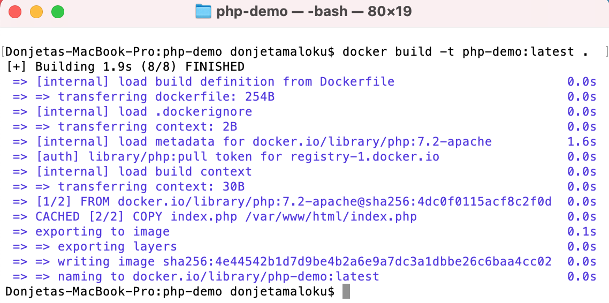

Së pari do të bëjm një prezantim të shkurtër se çfarë është Docker dhe pse ta përdorni, më pastaj do të marr një shembull si të krijoni aplikacionin tuaj të parë me Docker.

### Çfarë është Docker?
Docker është një platformë e hapur për zhvillimin,laciminin dhe ekzekutimin e aplikacioneve pa pas nevoj me instalu servera(XAMPP,Apache Tomcat) në makinën tuaj lokale. Po ashtu me Docker, ju mund të menaxhoni infrastrukturën tuaj në të njëjten mënyre siç e menaxhoni aplikacionin tuaj.


Pra Docker i lejon përdoruesit të krijojnë mjedis të pavarur dhe të izoluar për të lançuar aplikacionet e juaja. Këto mjedise quhen kontenjerë (eng. Containers).

Në një kontejnerë mund të vendosni aplikacionin e juaj, një databaze ose një sistem operative etj. Kjo do t'i lejojë zhvilluesit të ekzekutojë një apo më shumë kontejnerë në çfardo makine, server apo cloud.

### Imazhet

Një imazh Docker përmban gjithçka që nevojitet për të ekzekutuar një aplikacion si një kontejner. Kjo perfshin:
- kodi
- koha e ekzekutimit (runtime)
- librarit(libraries)
- variablat e mjedisit(enviroment variables)
- skedarët e konfigurimit(configuration files)

Imazhi më pas mund të vendoset në çdo mjedis Docker dhe të ekzekutohet si një kontejner.

### Kontejner
Një kontejner është një shembull i një imazhi në kohën e ekzekutimit. Nga një imazh mund të krijoni kontejnerë të shumtë (të gjithë ekzekutojnë aplikacionin e mostrës) në platformën e shumëfishtë Docker.
Një kontejner funksionon si një proces diskret në makinën tuaj. Për shkak se kontejneri funksionon pa nevojën për të nisur një sistem operativ të ftuar, ai është i lehtë dhe kufizon burimet (p.sh. memorien) që nevojiten për ta lënë të funksionojë.

### Pse duhet me përdor Docker një zhvillues?

Për t'iu përgjigje më së miri kësaj pyetje, shih listën më poshtë për përfitimet që mund të gjeni:

1. Docker është i shpejtë. Ndryshe nga një makinë virtuale, aplikacioni juaj mund të fillojë në pak sekonda dhe të ndalojë po aq shpejt.
2. Docker është multi-platformë. Ju mund të nisni kontejnerin tuaj në çdo sistem.
3. Kontejnerët mund të ndërtohen dhe shkatërrohen më shpejt se një makinë virtuale.
4. Nuk ka më vështirësi në konfigurimin e mjedisit tuaj të punës. Pasi të konfigurohet Docker juaj, nuk do t'ju duhet të riinstaloni më manualisht varësitë tuaja. Nëse ndryshoni kompjuterë ose nëse një punonjës i bashkohet kompanisë suaj, ju duhet t'i jepni atyre vetëm konfigurimin tuaj.
5. Ju e mbani të pastër hapësirën tuaj të punës, pasi secili prej mjediseve tuaja do të jetë i izoluar dhe ju mund t'i fshini ato në çdo kohë pa ndikuar në pjesën tjetër.
6. Do të jetë më e lehtë të lanconi projektin tuaj në serverin tuaj në mënyrë që ta vendosni atë në internet.

### Si te instalojm Docker?

Docker është në dispozicionë për të gjitha sistemet operative, MacOS, Windows dhe Linux.

Për detaje se si te instaloni Docker në sistemin operative mund te gjeni në këtë link [https://docs.docker.com/get-docker/](https://docs.docker.com/get-docker/)

Pasi të instalohet Docker me sukses dhe startoni në kompjuterin e juaj hapeni një terminal dhe shkruani këtë komandë për të shikuar se cili version i Docker është instaluar:

```bash
docker version
```


### Shembull si të paketojme aplikacionin tuaj ne Docker

Tani keni njohuri se cfare është Docker, është koha për të krijuar aplikacionin tuaj të parë!

Qëllimi i ketij tutoriali të shkurter është të paketojm një htlm faqe duke perdor Ngnix web server, dhe këtë html faqe do te nise permes nje Dockerfile.

>> Dockerfile është një tekst që përmbanë të gjitha komandat për te ndërtuar një imazh.

> Për më shumë detaje për NGNIX ju lutem shikoni ne kete link [https://www.nginx.com/](https://www.nginx.com/).

#### Krijo projektin e tuaj

Për të krijuar aplikacionin tuaj të parë Docker, ju rekomandoj të krijoni një folder të strukturuar si më posht:

```
.
├── html-page
    ── index.html
└── Dockerfile
```

`html-page/index.html` (Eshtë një htlm faqe statike).
`Dockerfile` (Ky skedar do të përmbajë udhezimet e nevojshme se si të shpërndajm html faqen).

#### Edito html skedar dhe shto nje titull

```html
<h1>Docker eshte magjik</h1>
```

#### Edito Docker skedar
Gjëja e parë që duhet të bëni kur dëshironi të krijoni skedarin tuaj Docker është të pyesni veten se çfarë doni të bëni. Qëllimi ynë këtu është të shpërndaj html faqen.

Hapi i parë që duhet të bëni kur krijoni një skedar Docker është të hyni në faqen e internetit të [DockerHub](https://hub.docker.com/). Kjo faqe përmban shumë imazhe të para-projektuara për të kursyer kohën tuaj (për shembull: të gjitha imazhet për ngnix).

Në rastin tonë, ne do të shkruajmë "Ngnix" në shiritin e kërkimit. Rezultati i parë është imazhi zyrtar i krijuar për të ekzekutuar Nginx. Pra, ne do ta përdorim atë!

```yaml
FROM nginx:latest 
COPY html-page /usr/share/nginx/html 
```

Duke përdorur komandën FROM në rreshtin e parë, ne po deklarojmë se imazhi i ri duhet të bazohet në imazhin nginx.
Komanda COPY përdoret në rreshtin e dytë për të kopjuar përmbajtjen nga direktoria html-page e sistemit pritës në direktorinë /usr/share/nginx/html të kontejnerit që do të krijohet.

#### Krijo imazhin Docker
Pasi kodi juaj është i shkruar ne Dockerfile, gjithçka që duhet të bëni është të krijoni imazhin tuaj që të përmbajë aplikacionin tuaj.

Hapeni nje terminal dhe shkruani komaden me poshte:

`docker build -t first-app:latest . `

Opsioni '-t' ju lejon të përcaktoni emrin e imazhit tuaj. Në rastin tonë ne kemi zgjedhur 'first-app' por ju mund të vendosni atë që dëshironi.



#### Ekzekutoni imazhin Docker
Pasi të krijohet imazhi, kodi juaj është gati për t'u lëshuar.

Për të startuar kontenjerin mund të ekzekutoni `docker run first-app:latest`, mirpo ne dëshirojm që ti qasemi aplikacionit nga shfletuesi, për atë duhet të specifikojm portin -p 8080:80 ku i tregojm docker që duhet të lidhesh portin 80 të kontenjerit me 8080 të makinës kryesore.
Po ashtu ju duhet të vendosni emrin e imazhit tuaj pas 'docker run'.

`docker run --name first-app -p 8080:80 first-app:latest`

Hapeni shfletuesin shkruani `localhost:8080` dhe do te shihni html faqen qe e keni edituar më parë me shkrimin 'Docker është magjik'.
Pra index.html është ruajtur brenda kotenjerit sepse e kemi ndërtuar në imazhin tonë duke përdor Dockerfile nga lartë.

Këtë projekt mund ta bëni clone nga Github në këtë link [First HTML Image](https://github.com/Programerat/first-html-image).