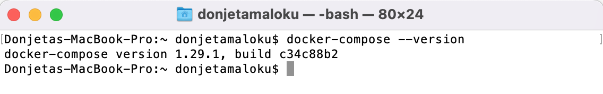

Në [artikullin e parë](https://programerat.github.io/2022/01/si-te-krijoni-aplikacionin-tuaj-te-pare-me-docker), kemi bërë një prezantim të shkurtër qfarë është Docker, si mund të instaloni si dhe si mund të konfiguroni Docker për një aplikacion bazik në PHP.
Në këtë artikull do të tregojm si mund të përdorim Docker Compose si dhe do të ndërtojmë një aplikacion të thjesht në PHP që do të komunikojë me MySQL.

### Docker Compose
Në arikullin e kaluar mësuam si të krijojm një Dockerfile dhe që përmes komandave `docker build` dhe `docker run` mund të ndërtojmë dhe të ekzekutojm një kontejnerë. Mirpo nëse duhet të ekzekutoni më shumë se një kontejnerë? Atëherë të ekzekutojmë këto komanda do të jetë e lodhshme.

Për këtë ju mund të kosideroni të përdorni Compose, një skedarë që përmbanë një bashkësi të instruksioneve, komandave për të përformuar një operim/veprim/funksionim.

Ashtu siq kemi krijuar Dockerfile për të definuar se si mund të duket një imazh, ne po ashtu mund të krijojm një `docker-compose.yml` skedarë ku mund të kemi imazhet që duam të përdorim, si dhe parametrat e komandave të docker ekzekutimit dhe të ndërtimit. Për të kuptuar më mirë do të marim një shembull duke krijuar skedarin tonë të parë `docker-compose.yml`.

Së parim hapeni terminalin tuaj dhe shikoni versionin e docker compose në makinën tuaj duke shkruar këtë komand.

`docker-compose --version`



Do të krijojmë një skedar bazik të docker compose, për shembullin në artikullin e parë.

```yml
version: '3'
services:
  website:
    container_name: php-demo
    build:
      context: ./
    volumes:
      - /src/index.php:/var/www/html/ #check volumes
    ports:
      - 8000:80
```
1. Në reshtin parë `version` duhet të shkruani versionin e docker compose. 
2. `services` përmbanë një list të gjitha veglave/serviset që keni për qëllim të ekzekutoni. Unë e kam emruar `website` për arsyje se kemi me printu një titull në shfletues, por ju mund të emroni edhe ndryshe, nuk ka rëndsi. Duhet të mbani mend se këtë emer do ta përdorim për të komunikuar me kontejner të tjerë.
3. `container_name` këtu duhet të emroni emrin e kontejnerit. 4. `image` duhet të vendosni emrin e imazhit.
5. Nër seksioni `build` ju shihni se kemi `context` që do të thot është duke shikuar për `Dockerfile`. Pra duhet të shkruani direktoriumin se ku gjendet `Dockerfile` i juaji. 

Skedari i juaj docker-compose.yml është gati dhe treguam për secilin seksion qka duhet të shkruajm. Përpara se të ekzekutoni është mirë të shikojm nëse konfigurimi në skedarin tonë është në rregull duke ekzekutuar në terminal komandën `docker-compose config`.

Take screenshot.

Siq shihet edhe në foton paraprake pra konfigurimet tona kan qenë në rregull. Tani mund të ekzekutojm `docker-compose up` për të krijuar imazhin(nëse nuk ekziton) dhe për të krijuar kontejnerat.

Screnshot.

Tash ne do të instalojm MySQL. Kam zgjedhur MySQL v8 ju mund të zgjedhni ndonjë version tjeter. Do të editojm  `docker-compose.yml` dhe do të shtojm konfigurimet për të instaluar MySQL.

```yml
version: '3.1'
services:
  mysql:
        image: mysql:8.0
        container_name: mysql-server
        command: --default-authentication-plugin=mysql_native_password
#        working_dir: /application
        volumes:
          - .:/application
        restart: always
        environment:
          - MYSQL_ROOT_PASSWORD=.test.
          - MYSQL_DATABASE=my_db
          - MYSQL_USER=db_user
          - MYSQL_PASSWORD=.mypwd
        ports:
          - "8082:3306"
  website:
    container_name: php-demo
    build:
      context: ./
    volumes:
      - /src:/var/www/html
    ports:
      - 8000:80
    depends_on:
      - mysql
```

Në këtë konfigurim ju mund të shihni se kemi shtu një seksion të ri `envrionment` i cili përmbanë disa parametra që lidhen me lidhjen me serverin MySQL. 
Porti i parazgjedhur 3306 është mapuar(eng. mapped) me portin 8082. Seksioni `restart: always` nënkupton kurdo që fillon kontejneri, MyQL do të filloj po ashtu.
Mund të keni vrejtur se kemi shtuar edhe seksioni `depends_on`, kjo nënkupton për të filluar servisi PHP, duhet të filloj së pari serveri MySQL.

Duhet të bëjm disa ndryshime në Dockerfile, ku do të shtojm konfigurime për instalimin e MySQL.

```Dockerfile
FROM php:8.0-apache
#Install git
RUN apt-get update \
    && apt-get install -y 
RUN docker-php-ext-install pdo pdo_mysql mysqli
COPY src/ /var/www/html/
EXPOSE 80
```
Ju duhet të instaloni një paket menagjuse për të ekzekutuar komandat e juaja mbrenda kontejnerit.
Psh. apt-get është një paket menagjuse që ndihmon në trajtimin e paketave në Linux. Si dhe duhet të instaloni Git.

> Për më shumë detaje për paketa menagjuse ju lutem lexoni më shumë. ## shto linkun

Kemi instaluar PHP extension si dhe MySQL. Në këtë rast docker ofron `docker-php-ext-install` për te instaluar shtesat për PHP.
Nese deshironi mund te instaloni edhe PHP Composer(shto linkun) e dim që është një paket menagjuse për PHP. 

Për të implementuar ndryshimet qe i kemi bërë në Dockerfile ne duhet të ekzekutojm komandën `docker-compose up --build`. Nëse nuk e shtojm `--build` docker-compose do të pranoj(access) imazhin i cili është shkarkuar më parë dhe konfigurimet e saj.

Nëse shkoni në shleftues localhost:8080 mund të shihni se të gjitha shtesat per mysql janë instaluar.

Ndoshta jeni duke pytur veten se si mund të shohim nëse është instaluar git si dhe nëse është duke ekzekutuar/running mysql?

#### Lidhshmëria në mes kontejnerëve në Docker
Tash do të shohim si është bërë lidhshmëria në mes kontejnerëve në Docker.

Përmendëm më lart se Docker na lejon me i ekzekutu komadat në kotejnerin që kemi krijuar dhe këtë mund ta bëjm duke ekzekutar komandën `docker exec`. 
Vihet pytja si mund të kyqem në MySQL? 
Së pari ne duhet të dijm emrin e imazhit për MySQL, dhe këtë informat e marin duke ekzekutuar `docker ps -a` në terminal.

Shikoni konfigurimet në docker-compose.yml që kemi bërë dhe e shihni që emrin e kontejnerit kemi vendos `mysql-server-80`. 
Dhe përgjigjen e pytjës që bëm mund ta marrim duke ekzekutuar këtë kommand në terminal:
`docker exec -it mysql-server-80 bash -l`

`-it` -->

Take screenshot.

Tash jemi mrena kontejnerit, na lejohet të shkruajm komanda të Linux pasi kemi instaluar paketen menagjuse apt-get.
Shkruani komandën `ls` ose qfar do komande tjetër.

Takse screenshot.
Për tu kyqyr në databazë duhet të shkruani këtë komand.
`mysql -u root -p`
`-u` -> user
`-p` -> password

Nëse doni me i pa databazat, duhet të shkruani në terminalin tuaj `show databases`.

Pra ktu treguam se si mund të shohim si është duke ekzekutar MySQL brenda Docker. Por si mund të interakt MySQL jasht docker? Si mund të konektohet MySQL client me MySQL server mbrenda kontejner? Këtë lidhje mund ta bëjm nëse bëjm port forwarding.

Së pari duhet të dijm id e kontejnerit si dhe portin dhe këto informata mund të gjejm duke ekzekutuar kommanden `docker ps -a`.

Take screenshot.
Mund të shihni se si Porti është percjell si dhe në cilin IP.
Në rastin ton kemi 0.0.0:8082->3306/tcp.
Pra 0.0.0 është host dhe porti është 8082.

Një komand tjeter se si mund të shihni portin e një kontejnerit `docker port 354675757456(containerid)`.

#### Interaksioni në mes disa kontejnerve në Docker
Pra kuptuam se si docker mund të kominikoj jasht, por cfar nëse kontejnerët duhet me interakt mes vete?

Një mënyr është të lidhemi(konektohemi) nëpermes IP së brendshme. Këtë mund të shihni duke shkruar komandën në terminalin tuaj `docker inspect [container-id]`, ky container-id është ID e kontejnerit për MySQL.

Tash do të editojm index.php dhe të shkruajm kodin për të bërë lidhjen me databazë.

```php
<?php
$conn = new mysqli("mysql", "root", ".", "my_db");
// Check connection
if ($conn->connect_error) {
	die("Connection failed: " . $conn->connect_error);
}

$sql = "SELECT name FROM users";
$result = $conn->query($sql);

if ($result->num_rows > 0) {
	// output data of each row
	while($row = $result->fetch_assoc()) {
		echo $row['name']."<br>";
	}
} else {
	echo "0 results";
}
$conn->close();
```

Nëse doni të ndalni docker-compose, atëher duhet të shkruani këtë komand `docker-compose down`.

## Konkluzioni
Në këtë artikull mësuam se si mund të konfigurojm mjesdise të shumëfishta me ndihmën e docker.